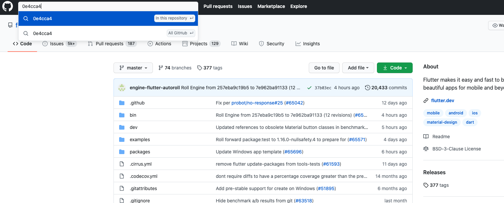

# Git Commit Short Version

在佈署過程，會需要用到 Git commit ID 來做對應處理，主要為需要知道此次的 編譯的 git 對應版本為何，實務上希望可以取得 short version 來對應即可。

> 後續了解有很多種取得方式，這邊只列出部分。

---

## 大綱

- [Git Commit Short Version](#git-commit-short-version)
  - [大綱](#大綱)
  - [何為 Commit ID](#何為-commit-id)
  - [git log 方式](#git-log-方式)
    - [拆解 git log 內容](#拆解-git-log-內容)
    - [git log 帶 pretty 命令格式](#git-log-帶-pretty-命令格式)
  - [git show 方式](#git-show-方式)
  - [git rev-parse 方式](#git-rev-parse-方式)
  - [git describe 方式](#git-describe-方式)
  - [結論](#結論)
  - [參考](#參考)

---
---

## 何為 Commit ID

Git Commit ID 為 git 在每一次的 commit 過程，會產生的一個以 SHA-1 hash 編碼。

而在 GitHub 或 Gitlab 皆可以在專案中，以 short commit ID 來查找對應的版本內容。

以 GitHub 其 Short 為 7 位數，而 GitLab 有到８位數 (不過用 7位數來找也是可以找到對應的版本)。

- GitHub search commmit by commit ID

  

- GitLab search commit by commit ID

  

---
---

## git log 方式

### 拆解 git log 內容

利用 git log 的命令來查找所需內容。

此方法比較不是那麼正統的感覺，後續有找到其他方式來替代 [git show](#git-show-方式)。

**剖析 git log 在拆解字串抓取我們要使用的方式 :**

- sample code :

  ``` shell
    prepreExported_GitHash_Full="$(git log -1 | grep commit | cut -d' '   -f2)"
    prepreExported_GitHash_Short=${prepreExported_GitHash_Full:0:8}
  ```

其中

- prepreExported_GitHash_Full: git commit ID 完整內容
  - `git log -1` : 抓取 git 最後 log 的內容，
  - `grep commit` : 擷取第一筆有 commit 內容
  - `cut -d' '   -f2` : 以空格 ' ' 做分隔，取分隔後第二筆內容

- prepreExported_GitHash_Short : 擷取前八位當做 short 的 commit ID

範例:

> prepreExported_GitHash_Full : b590a89292a4726c7b526456f5c1c8ef3d08eb9e
>
> prepreExported_GitHash_Short : b590a892

---

### git log 帶 pretty 命令格式

git log 也可以帶入 pretty 參數，然後定義格式來處理

**範例 :**

- Full commit ID :

  - sample code :

    ``` shell
      git log -1 --pretty=format:%H
    ```

  - Result :

    ``` log
      d17df342616d8dfe851469ce6c1775f995d91f3d
    ```

- Short commit ID :

  - sample code :

    ``` shell
      git log -1 --pretty=format:%h
    ```

  - Result :

    ``` log
      d17df34
    ```

---
---

## git show 方式

後來找到 git show 的命令，可以更加簡潔使用

**範例 :**

- Full commit ID :

  取得完整的 Commit ID (commit 的 hash code)

  - sample code:

    ``` shell
      git show -s --format=%H
    ```

  - Result:

    ``` log
      d17df342616d8dfe851469ce6c1775f995d91f3d
    ```

- short commit ID :

  取得 short 的 Commit ID

  - sample code:

    ``` shell
      git show -s --format=%h
    ```

  - Result:

    ``` log
      d17df34
    ```

---
---

## git rev-parse 方式

- sample code :

  ``` shell
    git rev-parse --short HEAD
  ```

- Result :

  ``` log
    d17df34
  ```

---
---

## git describe 方式

- sample code :

  ``` shell
    git describe --always
  ```

- Result :

  ``` log
    d17df34
  ```

---
---

## 結論

上面的方式目前測試是都可以 work，而透過命令下參數直接取得的 short commit ID 都是七位數。

目前以 git show 搭配參數取得比較直覺，所以改用此方式取得 short commit ID。

> git show -s --format=%h

---
---

## 參考

- [git svn - What is a Git commit ID? - Stack Overflow](https://stackoverflow.com/questions/29106996/what-is-a-git-commit-id)

- [Get the short Git version hash - Stack Overflow](https://stackoverflow.com/questions/5694389/get-the-short-git-version-hash)

---
---

[=> Top](#git-commit-short-version)

[=> Go Back](../README.md)
