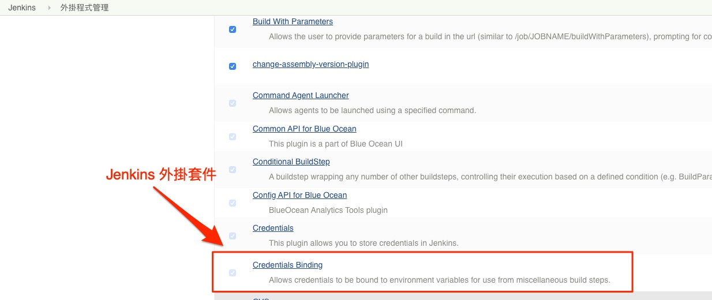
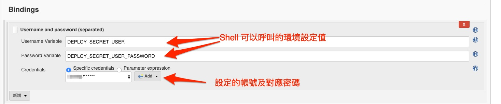
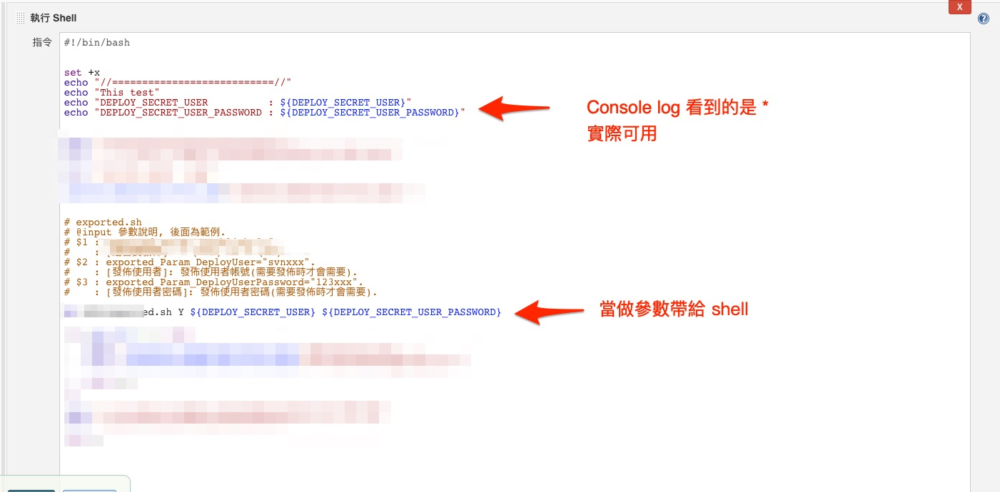

# Authentication 憑證問題

## 源由

> 在某次的 jenkins 建立 mac ios (Framework) 專案，
> 原始目的是透過 jenkins project 觸發該專案執行編譯並將結果commit 到 svn 所屬專案。
>
> 在此過程本地端的 mac 執行 OK，
> 但透過該方式會出現憑證失敗(svn: E215004)。
>
> 在此記錄一下當初的歷程。

---

## svn commit 失敗錯誤訊息

* 一開始的錯誤訊息如下 (與 Authentication 有關)

> execute svn commit
>
> svn: E170013: Commit failed (details follow):
>
> svn: E170013: Unable to connect to a repository at URL 'https://......'
>
> svn: E215004: No more credentials or we tried too many times.
>
> Authentication failed

---

## Jenkins 後續處理

* 在 mac client svn commit 需要輸入帳號/密碼

* 有找到外掛 Bindings
  * 由 jenkins 上面的帳號管理來帶入給 shell 的參數
  * 實測過帳號密碼是從 log dump 不出來的

* 安裝 Jenkins 外掛套件
  

* Jenkins 專案引用 - 1
  

* Jenkins 專案引用 - 2
  
